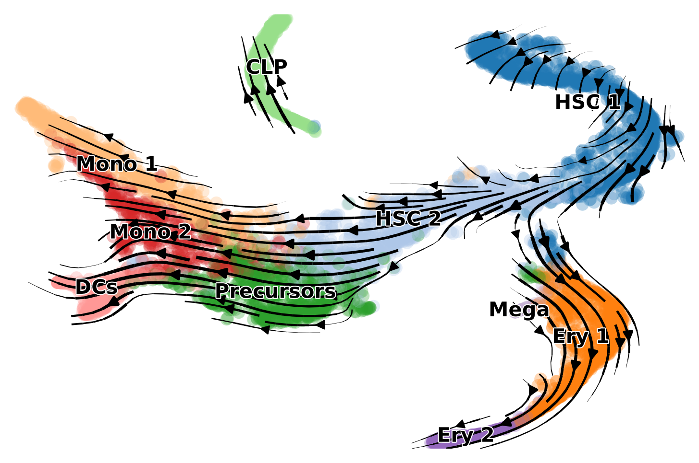

# UniTVelo for RNA Velocity Analysis

Temporally unified RNA velocity for single cell trajectory inference (UniTVelo) is implementated on Python 3 and TensorFlow 2. The model estimates velocity of each gene and updates cell time based on phase portraits concurrently.


The major features of UniTVelo are,

* Using spliced RNA oriented design to model RNA velocity and transcription rates
* Introducing a unified latent time (`Unified-time mode`) across whole transcriptome to incorporate stably and monotonically changed genes
* Retaining gene-spcific time matrics (`Independent mode`) for complex datasets

UniTVelo has proved its robustness in 10 different datasets. Details can be found via our manuscript in bioRxiv which is currently under review ([UniTVelo](https://www.biorxiv.org/content/10.1101/2022.04.27.489808v1)).

## Installation

### GPU Acceleration

UniTVelo is designed based on TensorFlow's automatic differentiation architecture. Please make sure [TensorFlow 2](https://www.tensorflow.org/install) and relative [CUDA](https://developer.nvidia.com/cuda-downloads) dependencies are correctly installed.

Use the following scripts to confirm TensorFlow is using the GPU.

```python3
import tensorflow as tf
print ("Num GPUs Available: ", len(tf.config.list_physical_devices('GPU')))
```

If GPU is not available, UniTVelo will automatically switch to CPU for model fitting or it can be spcified in `config.py` (see `Getting Started` below).

### Main Module

(Optional) Create a separate conda environment for version control and to avoid potential conflicts.

```python3
conda create -n unitvelo python=3.7
conda activate unitvelo
```

UniTVelo package can be conveniently installed via PyPI or directly from GitHub repository.

```python3
pip install unitvelo
```

or

```python3
pip install git+https://github.com/StatBiomed/UniTVelo
```

## Getting Started

### Public Datasets

Examples of UniTVelo and steps for reproducible results are provided in Jupyter Notebook under `notebooks` folder. Specifically, please refer to records analyzing [Mouse Erythroid](notebooks/Figure2_ErythroidMouse.ipynb) and [Human Bone Marrow](notebooks/Figure3_BoneMarrow.ipynb) datasets.

### RNA Velocity on New Dataset

UniTVelo provides an integrated function for velocity analysis by default whilst specific configurations might need to be adjusted accordingly.

1. Import package

```python3
import unitvelo as utv
```

2. Sub-class and override base configuration file (here lists a few frequently used), please refer `config.py` for detailed arguments.

```python3
velo = utv.config.Configuration()
velo.R2_ADJUST = True 
velo.IROOT = None
velo.FIT_OPTION = '1'
velo.GPU = 0
```

* Arguments:
  * -- `velo.R2_ADJUST` (bool), linear regression R-squared on extreme quantile (default) or full data (adjusted)
  * -- `velo.IROOT` (str), specify root cell cluster would enable diffusion map based time initialization, default None
  * -- `velo.FIT_OPTION` (str), '1' Unified-time mode (default), '2' Independent mode
  * -- `velo.GPU` (int), specify the GPU card used for fitting, -1 will switch to CPU mode, default 0.

3. Run model (label refers to column name in adata.obs specifying celltypes)

```python3
adata = utv.run_model(path_to_adata, label, config_file=velo)
scv.pl.velocity_embedding_stream(adata, color=label, dpi=100, title='')
```

4. Evaluation metrics (Optional)

```python3
# Cross Boundary Direction Correctness
# Ground truth should be given via `cluster_edges`
metrics = {}
metrics = utv.evaluate(adata, cluster_edges, label, 'velocity')

# Latent time estimation
scv.pl.scatter(adata, color='latent_time', color_map='gnuplot', size=20)

# Phase portraits for individual genes (experimental)
utv.pl.plot_range(gene_name, adata, velo, show_ax=True, time_metric='latent_time')
```
